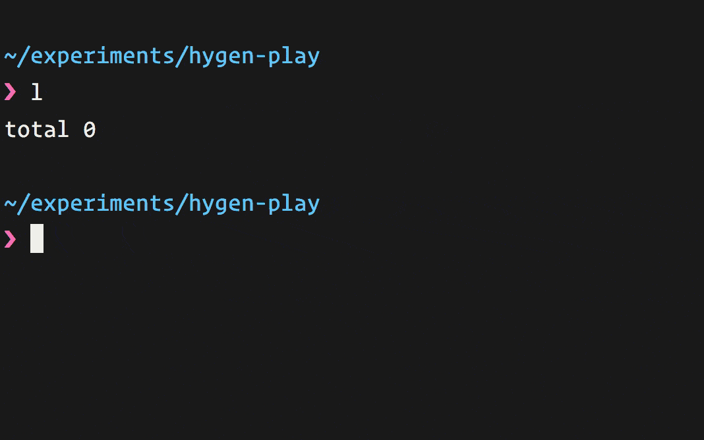

<h3 align="center">
  
</h3>


`hygen` is a simple, fast, and flexible code generator and generator builder.



## Quick Start

Install `hygen`:

```
$ npm i -g hygen
```

Want to try an example generator?

```
$ hygen

Error: please specify a generator.

Available actions:
init: self
mailer: init, new
worker: init, new

$ hygen mailer new
```

This will generate content into the current working directory in `app`.

Here's a few more ways to play with the samples:

```
# generate all required worker files
$ hygen worker new --name reporter

# generate one specific file
$ hygen worker new:init --name reporter

# generate all files that correspond to a regular expression
$ hygen worker 'new:set.*' --name reporter
```

Want to start using `hygen` in your own project?

```
$ hygen init self
```

This will create a project-local `_templates` folder for your at your source root, with a sample template.

## Templates

`hygen` comes with [prepacked templates](src/templates) for node.js workers and mailers, which you probably don't
need if you're not using a `hyperstack`. To see them run `hygen`.

For your own use, let's create a folder named `_templates` in your project root. In it, build the following template layout:

```
_templates/
  worker/
    new/
      index.ejs.t
```

Here's how:

```
$ mkdir -p _templates/worker/new
$ touch _templates/worker/new/index.ejs.t
```

Next, `index.ejs.t` should contain this (just copy and paste it):

```javascript
---
to: app/workers/<%=name%>.js
---
class <%= h.capitalize(name) %> {
    work(){
        // your code here!
    }
}
```

Finally, you can generate a worker like this:

```
$ hygen worker new --name cleaner

Loaded templates: _templates
       added: app/workers/cleaner.js
```

## Variables

There are two ways to supply variables.

### Arguments

For unattended generation, it's best to use arguments:

```
$ hygen worker new --name foobar --message hello --type 8
```

All double-dash (`--`) arguments become available to you in your
templates, so this will populate them.

```erb
Hi <%= name %>,
<%= message %>.

You've been selected to group <%= type %>.
```

### Prompt

If you prefer some of your generators to be interactive (you can mix and match), you can use prompts.

Per generator, you have the option to include a `prompt.js` file, that will collect all variables from the user for this given generator.

```
_templates/
  worker/
    new/
      prompt.js    <-- your prompt file!
      html.ejs.t
```

The [format](src/templates/mailer/new/prompt.js) is based on [inquirer](https://github.com/SBoudrias/Inquirer.js) so hopefully, nothing new to you.

## A Different Kind of a Generator

`hygen` has developer ergonomics as first priority; it avoids
cluttered template projects which are hard to reason about, and simplifies overly complex generator workflows.

It cuts the time from having an itch generating code in your current
project to code generated with it and others benefiting from it.

Let's go over why `hygen` is different. Here's our example from before:

```
_templates/
  worker/
    new/
      index.ejs.t
```

### Template Locality

`hygen` picks up a local `_templates` folder
at any folder level of your project you're working from.

This is important because:

* Templates are project-local. A git clone of the project fetches all generators as well.
* Different generators can be tucked in different parts of the project, making it contextual.
* Template locality is scalable; different teams can maintain different generators.
* When you change your code, you can make changes in the template and pack in the same commit, to be reviewed and merged in the same PR (as opposed to installing different "plugins" or different templates from out-of-repo places).

And yet, if you don't like project-local templates:

* You can have a global `_templates` folder (maybe a central git repo you maintain?) by populating an environment variable `HYGEN_TMPLS`
* You can build a [custom generator](#build-your-own) of your own with `hygen` at its core, and pack your own templates with it.

### Folder Structure is Command Structure

The templates folder structure _maps directly_ to the command structure:

```
$ hygen worker new --name jobrunner
```

For this command, `hygen worker new` maps to `_templates/worker/new` and all files within `worker/new` are rendered.

Template parameters are given with `--flag VALUE`, as many as you'd like. In this example we've set a parameter named `name` to the value `jobrunner`.

### Subcommands

A subcommand is a file inside a your folder structure. So if the structure is this:

```
_templates/
    worker/
      new/
        index.html.ejs
        setup.html.ejs
```

And you only want `setup`, you can run:

```
$ hygen worker new:setup
```

You can also use the subcommand as a regular expression so, these will do the same:

```
$ hygen worker new:se
```

```
$ hygen worker new:se.*
```

### Frontmatter for Decluttering

Here's how a template looks like (in our example, `index.ejs.t`). Templates bodies are [ejs](https://github.com/tj/ejs):

```javascript
---
to: app/workers/<%=name%>.js
---

class <%= h.capitalize(name) %> {
    work(){
        // your code here!
    }
}
```

The first part of the template is a [front matter](https://jekyllrb.com/docs/frontmatter/), idea borrowed from Markdown, this is the metadata part of a `hygen` template and is part of the reason of why your templates will feel more lightweight and flexible.

All frontmatter metadata _are also run through the template engine_ so feel free to use variables in the frontmatter as you wish.

There's one required metadata variable: `to`.
`to` points to where this file will be placed (folders are created as needed).

### Addition or Injection

By default templates are 'added' to your project as a new target file, but you can also choose to inject a template _into_ an existing target file.

For this to work, you need to use `inject: true` with the accompanied inject-specific props.

```yaml
---
to: package.json
inject: true
after: dependencies
skip_if: react-native-fs
---
"react-native-fs":"*",
```

This template will add the `react-native-fs` dependency into a `package.json` file, but it will not add it twice (see `skip_if`).

Here are the available mutually-exclusive options for where to inject at:

* `before | after` - a regular expression / text to locate. The inject line will appear before or after the located line.
* `prepend | append` - add a line to start or end of file respectively.
* `line_at` - add a line at this exact line number.

You can guard against double injection:

* `skip_if` - a regular expression / text. If exists injection is skipped.

### Build Your Own

`hygen` is highly embeddable. You should be able to use it by simply listing it
as a dependency and having [this kind of workflow](src/index.js) in your binary.

```javascript
const { runner } = require('hygen')
const path = require('path')
const defaultTemplates = path.join(__dirname, 'templates')

runner(process.argv.slice(2), {
  templates: defaultTemplates,
  cwd: process.cwd(),
  logger: console,
  debug: !!process.env.DEBUG
})
```

# Development

The Hygen codebase has a functional style where possible. This is because naturally, it
feeds parameters and spits out files. Try to keep it that way.

Running `hygen` locally, rigged to your current codebase (note the additional `--` to allow passing flags)

```
$ yarn hygen -- mailer new --name foobar
```

Running tests in watch mode:

```
$ yarn watch
```

## Metaverse Testing

The easiest way to make an impact is to use the built-in [`metaverse`](src/__tests__/metaverse) tests suite, and then add the tests [here](src/__tests__/metaverse.spec.js).

The idea here is to copy templates from any project that use `hygen` and to test that it works at all times. This keeps tabs on the hygen universe / ecosystem (nicknamed metaverse) and makes sure this test suite breaks before `hygen` clients break.

## Internal Testing

Testing `hygen` internally is also easy. We provide an [abstraction layer](src/test/ftest.js)
(Note [here be dragons](src/__tests__/readme.md)) for easy end-to-end testing with a virtual file system.

The rest of the tests [are here](src/__tests__/)

# Contributing

Fork, implement, add tests, pull request, get my everlasting thanks and a respectable place here :).

### Thanks:

To all [Contributors](https://github.com/jondot/hygen/graphs/contributors) - you make this happen, thanks!

# Copyright

Copyright (c) 2018 [Dotan Nahum](http://gplus.to/dotan) [@jondot](http://twitter.com/jondot). See [LICENSE](LICENSE.txt) for further details.
